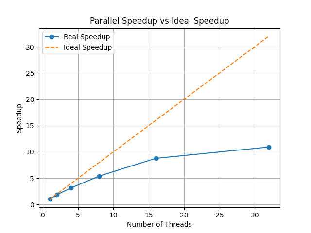

# Java Parallel Speedup Benchmark

This project evaluates the performance improvement obtained by parallelizing
a CPU-intensive task using Java threads.

The benchmark computes prime numbers and compares execution time between
sequential and parallel implementations using different numbers of threads.

---

## Hardware

CPU: AMD Ryzen AI 9 HX 370  
Cores: 12 physical cores / 24 threads  
RAM: 32 GB  
GPU: NVIDIA GeForce RTX 4060 Laptop GPU
OS: Windows  
Java: OpenJDK

---

## Benchmark configuration

Tasks: 200  
Task size: 200000  

Threads tested:

1, 2, 4, 8, 16, 32

---

## Results

| Threads | Time (s) | Speedup |
|--------|--------|--------|
| 1 | 4.61 | 1.00 |
| 2 | 2.48 | 1.86 |
| 4 | 1.47 | 3.15 |
| 8 | 0.85 | 5.41 |
| 16 | 0.52 | 8.77 |
| 32 | 0.42 | 10.92 |

---

## Speedup Graph
 

---

## Description

The benchmark demonstrates how performance scales when increasing the number
of threads. Speedup improves significantly until approaching the number of
physical CPU cores, after which the improvement becomes smaller due to
thread management overhead and hardware limits.
